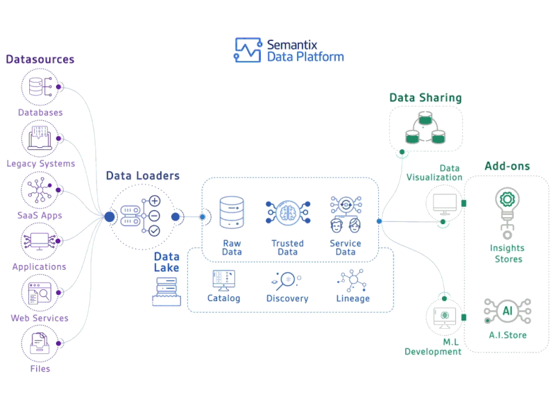
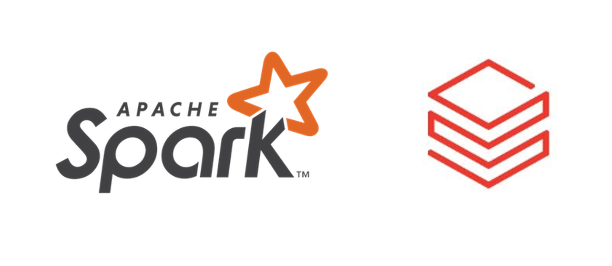
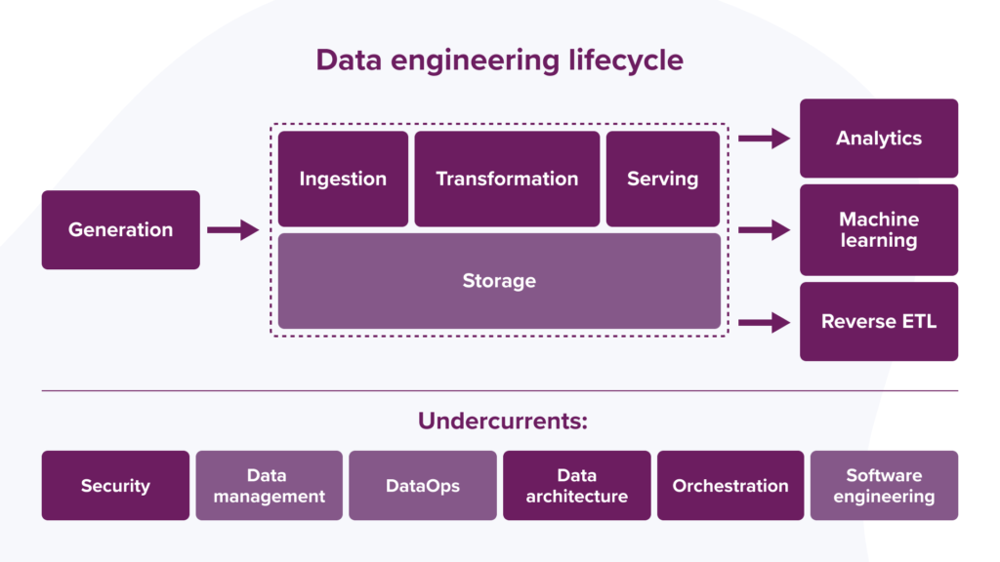

Hello learner 👋, Welcome to the data engineering guide!

### Introduction

As data engineers we deal with various data and engineering aspects to serve the data to stakeholders. There are a ton of tools used in the modern data engineering(DE) to achieve this.

As a beginner or even as an experienced data professional, setting the right context about the field and to understand what skills are required along the path to become a data engineer is a bit cumbersome.

This guide intends to solve that specific problem. It tries to provide a clear context and core skills for DE and beyond. More on the guide [here](https://www.learndataengineering.guide/faqs/).

### Big Data Era and Modern Data Engineering Landscape

Internet ushered the big data era. The opensource revolution of the [Hadoop ecosystem](https://www.geeksforgeeks.org/hadoop-ecosystem/) years enabled any oraganization with decent IT experiennce to build their own data platforms that could be on par with the internet companies of Silicon Valley.

Shortly after their success, the opensource tools fell short of their expectations since they needed lot of software engineering, networking and baby-sitting skills to get the right data output within time.

The [modern data engineering platform](https://towardsdatascience.com/the-building-blocks-of-a-modern-data-platform-92e46061165) greatly abstracts a lot of complexities of the data stack of the previous Hadoop years. The focus is on serving the quality data at scale with confidence and with minimal intrevention.

|  |
|:--:|
| *Image Credits - [Semantix](https://docs.semantix.cloud/)*|

In modern data platforms, the popular opensource big data tools are productized abstracting away the complexity from the end users i.e., data teams.

For example: [Databricks](https://www.databricks.com/) offers [Apache Spark](https://spark.apache.org/) as a unified compute platform for data engineering and data science workloads.

|  |
|:--:|
| *Image Credits - [Databricks](https://www.databricks.com/)*|

There are cloud-first data warehouses like [Snowflake](https://www.snowflake.com/) and [Big Query](https://cloud.google.com/bigquery) as the alternatives to the opensource tools. They offer enterprise data management tools for veriety of data teams right out of the box.

Since the focus has shifted from data tools to resulting data once again, We see a growing interest in modern data tools and processes.

### Data Engineering Lifecycle

Lets talk about the data engineering lifecycle. It is the heart of all the activities that a data engineering team performs.

|  |
|:--:|
| *Image Credits - [Fundamentals of Data Engineering Book](https://xebia.com/blog/fundamentals-of-data-engineering/)*|

The different stages of data engineering lifecycle are:

1. **Generation** - data is produced at source systems

2. **Ingestion** - data is copied from source systems to a storage system at a pre-defined interval

3. **Storage** - data storage like data lake or data warehouse

4. **Transformation** - data from one or more sources is converted to a specified format

5. **Serving Data** - transformed data is made available for various stakeholders for further analysis

The data engineering lifecycle also encompasses the underlying activities like:

- **Security** - Access control to data and systems

- **Data Management** - Data Discoverability, Data Definitions, Data Accountability, Data Modeling, Data Integrity

- **DataOps** - Observability, Monitoring, Incident reporting

- **Data Architecture** - Analyze trade-offs, Design for agility, Add value to the business

- **Orchestration** - Coordinate workflows, Schedule jobs, Manage tasks

- **Software Engineering** - Programming and coding skills, Software design patterns, Testing and Debugging

Most of the activties that a data engineering team performs on a daily basis can be achieved using few core skills listed in the next section. Ofcourse, this is not a complete list but it'll cover the necessary skillset.

### Skillset for Modern Data Engineering

Without complicating, data engineers need strong data skills and good software engineering skills. The list of important skills are arranged in phases.

#### Phase 1- Data Skills

- SQL
- Data Warehousing
- Data Modelling

#### Phase 2- Software Engineering Skills

- One programming language. Preferrably Python.
- Git

#### Phase 3- Data Engineering Tools

- Basics of distributed computing
- Hadoop Ecosystem Components
- Data Warehouse like Apache Spark with Cloud Storage or Snowflake, BigQuery

#### Phase 4- Additional Skills

- Pipeline Orchestration tools like Airflow, Azure Data Factory and etc
- Cloud services for data engineering

Lets discuss [phase 1](https://www.learndataengineering.guide/data-skills).
