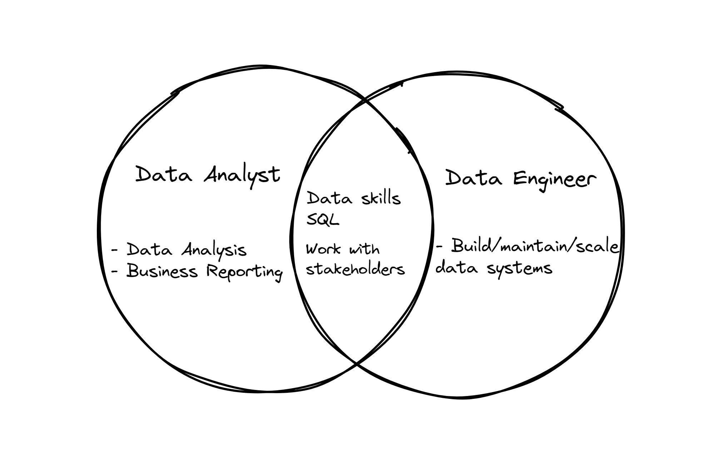

### What are data skills?

Data in and of itself is not valuable or readily consumable for analysis. Especially if it originates from various sources and in several formats. The goal of any business is to leverage the data and drive the improvement.

Data professionals like data engineers or a data analysts will try to make sense of the data within a business context to extract meaningful information from it.

For example:

- A BI developer will understand the business requirements, accesses the data, likely from various sources; and generates the reports for business users

- A data scientist will understand the business requirements and develop the ML models to predict the user behaviours.

Having the domain knowledge of the data combined with technical skills to extract the information are called as data skills.

### Domain Knowledge

Domain Knowledge is something that is aquired gradually over the time while working in a particular field. It holds the core details of the business, technical details of the broader field, operations, regulatory compliances and many other aspects.

Suppose, you are working with a company specializes in pharmaceutical domain. Knowing the technical details of how the domain operates on a high level is invaluable in understanding the data itself. Again, this knowledge is completely different from, say, an ecommerce domain.

### Technical Knowledge (for data engineers)

Understanding of different operational systems (source systems) like databases, APIs, event streaming system and etc. that are used in the data architecture. For data engineers, this knowledge is important.

We need to understand the format and frequency of the data being generated at those sources. Later, we can design processes to bring the data into an analytical system like a data warehouse for futher processing, analysis and serving.

Once the data lands in the analytical system, the data is converted into a specific format defined by business and then served to various stakeholders. There are various tools available to data engineers to perform their tasks and provide the data downstream users.

We also need concepts like Data Warehousing and Data Modelling to understand efficient data storage and provide a consistent view of the data across the organization respectively.

First, lets understand the typical data engineering(**DE**) process.

### Understanding the Typical Data Engineering Processes

Data engineering team(s) acts as data and knowledge brokers within a company. A typical DE process will start with copying the data from various operational system into an analytical system like a data warehouse.

Below diagram represents a typical DE pipeline with all the activities carried out by the DE team.

|  |
|:--:|
| *[A Typical Data Pipeline]*|

**Sources**:

- Sources are typically the operational systems like a database, a CRM system, an API, an event streaming system and etc.

- These systems will record the current state of the business. Ex: Order status in orders database table. It will have only the latest order status for the orders

- Operational systems, like a database, are designed to serve millions of customers at once and to update individual records frequently.

- Operational systems are not suitable for performing in-depth analysis as their main purpose is to serve customers without any downtime.

- Knowledge on how the data is produced in the operational systems, type of the data, frequency of updates (data and system) and capturing those updates into the data warehouse is required for the DE team

- A data ingestion framework that includes capturing and storing the data for each type of data source will be created.

**Raw, Staging and Serving**:

- Data in the raw layer can be in different formats like [structured, semi-structured and unstructured](https://k21academy.com/microsoft-azure/dp-900/structured-data-vs-unstructured-data-vs-semi-structured-data/).

- After data ingestion, it is transformed into a format specified by the business. This data will be stored in staging layer for further analysis.

- Staging layer will have the data from various sources that is ready to be consumed by various downstream systems like BI tools, Machine learning, business reporting and etc.

- Serving layer mostly consists of aggregated data ready to be consumed by a BI tool or for reporting to the business.

- More often than not, staging and serving layers will have tables that has the data from various sources according to the requirements.

### Technical skills Overview

**Building Pipelines**:

- Building pipelines include a lot of tasks like
  - Interfacing various sources into data ingestion layer
  - Processing data
  - Scheduling and Monitoring pipelines
  - Cloud Automation and house cleaning activities in DE infrastructure
- Knowledge on a programing language is a must. As Data engineers we need to write production-grade code that could scale well.
- Python is one of the best choice to build DE processes right now. Most data ingestion frameworks and job scheduling, and general automation use python based tools
- Most of the libraries that are used in DE, data science and machine learning fields are available in Python as well

More on this in [phase 2](https://www.learndataengineering.guide/docs/phase2/programming-skills).

**SQL**:

- SQL is one skill that is common across all the data roles. It is used to perform various operations like
  - Data cleaning and transformation
  - Data modelling
  - Data analysis and adhoc data quering

- SQL is the de facto standard to query the data(tabular/relational) across the databases, data warehouses and query engines.
- Most of the data processing steps can be defined in simple SQL queries also

More on this in [here](https://www.learndataengineering.guide/phase1/sql).

|  |
|:--:|
| *[Data Skills overlap between two data roles]*|