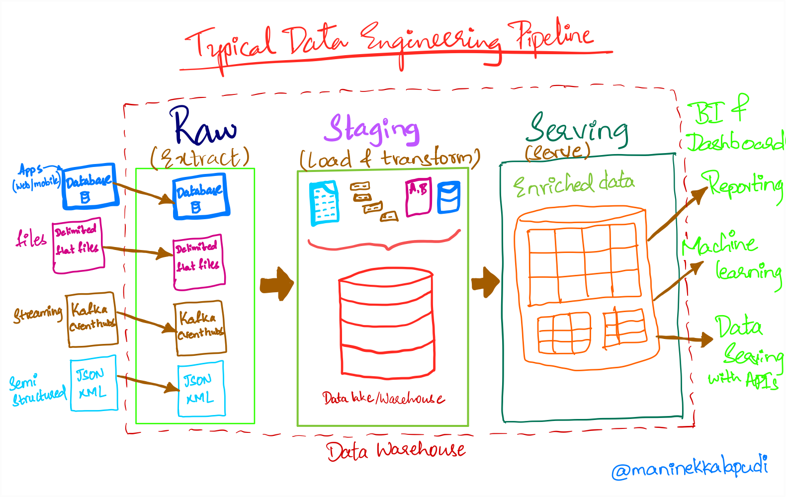

### What are data skills?

Data in and of itself is not valuable or readily consumable. The goal is to make sense of the data and extract meaningful information from it.

Data professionals like data engineers or a data analyst will try to make sense of the data within a business context by applying certain logic to get information from the data.

For example:

- A BI developer will understand the business requirements, accesses the data from various tables or sources and generate the reports for business users

- A data scientist will understand the business requirements and develop the ML models to predict the user behaviours.

Having the domain knowledge of the data combined with technical skills to extract the information are called as data skills.

### Domain Knowledge

Domain Knowledge is something that is aquired gradually over the time working in a particular field. It holds the core details of the business, technical details, operations, regulatory compliances and many broader aspects.

Suppose, you are woking with a company specializes in pharmaceutical domain. Knowing the technical details of how the domain operates on a boarder level is invaluable in understanding the data itself. Again, this knowledge is completely different from, say, an ecommerce domain.

### Technical Knowledge

Understanding of different operational systems (source systems) like databases, APIs, event streaming system and etc. For data engineers, this knowledge is important.

We need to understand the format and frequency of the data being generated at those sources. Later, we can design an ingestion pipeline(s) to bring the data from operational systems to analytical system like a data warehouse.

Once the data lands in the analytical system, the data is converted into a specific format and then served to various stakeholders.

We also need to understand concepts like Data Warehousing and Data Modelling to store data efficiently and provide a consistent view of the data across the organization. Lets dive deep in these in the next section.

Now, lets understand the typical data engineering process.

### Understanding the Typical Data Engineering Processes

Data engineering team(s) acts as data and knowledge brokers within a company. Data from various operational system within the business will be captured into analytical systems like a data warehouse. Later it will be processed and served to different stakeholders.

Below diagram represents a typical data engineering pipeline with all the activities carried out by the DE team. Lets understand this in the context of skills.

|  |
|:--:|
| *[A Typical Data Pipeline]*|

**Sources**:

- Sources are typically the operational systems like a database, a CRM system, an API, an event streaming system and etc.

- These systems will record the current state of the business. Ex: Order status in orders database table. It will have only the latest order status for the orders

- Operational systems, like a database, are designed to serve millions of customers at once and to update individual records frequently.

- Operational systems are not suitable for performing in-depth analysis as their main purpose is to serve customers without any down time.

- Knowledge on how the data is produced in the operational systems, type of the data, frequency of updates and capturing updates into a data warehouse is required for the data engineering team

- A data ingestion framework that includes capturing and storing the data for each type of data source will be created.

**Raw, Staging and Serving**:

- Data in the raw layer can be in different formats like [structured, semi-structured and unstructured](https://k21academy.com/microsoft-azure/dp-900/structured-data-vs-unstructured-data-vs-semi-structured-data/).

- After data ingestion, it is transformed into a format specified by the business. This data will be stored in staging layer for further analysis.

- SQL is one skill that is common across all the data roles. It is used to perform various operations like cleaning, transforming, data analysis, data modelling on the tabular/relational data.

- Staging layer will have the data from various sources that is ready to be consumed by various downstream systems like BI tools, Machine learning, business reports and etc.

- Serving layer mostly consists of aggregated data ready to be consumed by a BI tool or for reporting to the business.

- More often then not staging and serving layer will have tables that has the data from various sources according to the requirements.
