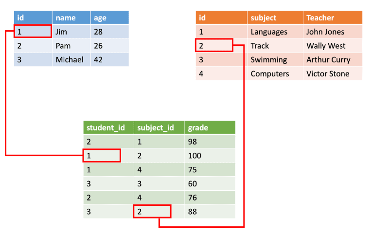
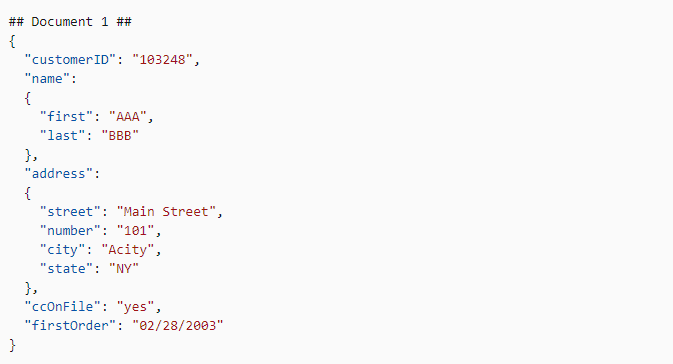

### What is SQL?

SQL (Structured Query Language) is a [declarative language](https://en.wikipedia.org/wiki/Declarative_programming) for storing, manipulating and retreiving data in databases and many other data processing systems.

We write statement like queries in SQL to perform actions on the data in a data processing system.

Example: Query retreives all the records from a database table

```sql
SELECT * FROM <database_name>.<table_name> 
```

It offers a simple interface to interact with data without having to write lengthy programs. This has served wide veriety of data roles from various backgrounds well over four decades.

### Why Data Engineers Need SQL?

Data engineering is a data aware role. Every data engineer functions as a data analyst to understand the complexities of the data. Having technical skills to work with data and domain knowledge about the it is very crucial to the role.

Data engineering tools and processes have evolved quite a lot over the years. One tool kept its relevance through all these times i.e., SQL.

Since SQL offered a simple interface to deal with data, many data warehousing tools like [Hive](https://aws.amazon.com/big-data/what-is-hive/), [Snowflake](https://www.snowflake.com/en/), [BigQuery](https://cloud.google.com/bigquery), and query engines like [Apache Spark](https://spark.apache.org/) adopted SQL as one of their main interfaces.

This will help data teams to work with SQL for many tasks like

  1. Building data models
  2. Light-weight data cleaning
  3. Data transformations and testing
  4. Data analysis
  5. Building reports

Of course, SQL is not be-all and end-all solution for all data engineering tasks but it is arguably a very important skills in modern data engineering.

### Types of Data in Data

Data in the data engineering domain can be broadly classified into [structured, semi-structured and unstructured](https://k21academy.com/microsoft-azure/dp-900/structured-data-vs-unstructured-data-vs-semi-structured-data/) data.

- **Structured**:

  - Data is arranged in rows and columns like a table
  - Each column can store a data of single datatype. Ex: Integer, String etc.
  - Data follows a strict format and it is widely used in performing analysis
  - SQL is predominently used to analyze this kind of data
  - Relational databases, csv files and etc., store this type of data

|  |
|:--:|
| *[Structured Data](https://k21academy.com/microsoft-azure/dp-900/structured-data-vs-unstructured-data-vs-semi-structured-data/)*|

- **Semi-Structured**:

  - Data is loosely structured meaning it doesn't follow a standard structure.
  - JSON, XML data and data stored in key-value stores and graph databases

|  |
|:--:|
| *Semi-structured Data*|

- **Unstructured**:

  - Data is not structured at all and doesn't follow any pre-defined data model.
  - Examples are video, audio, images, logs, and binary data files

|  |
|:--:|
| *Unstructured Data*|

### SQL Topics

|  |
|:--:|
| *SQL Topics*|

1. Table/View Operations

   - `CREATE`
   - `ALTER`
   - `TRUNCATE`
   - `DROP`

2. Data Retrieval

   - `SELECT`, `DISTINCT`
   - `WHERE` clause with `IN`, `AND`, `OR`, `NOT`, `LIKE` and `BETWEEN`
   - `COUNT`, `SUM`, `MIN`, `MAX`, `AVG`

3. Data Manipulation

   - `INSERT`
   - `UPDATE`
   - `DELETE`
   - `MERGE`

4. Aggregations

   - `GROUP BY`
   - `ORDER BY`
   - `HAVING`

5. Joins

   - `INNER`
   - `LEFT`
   - `RIGHT`
   - `FULL OUTER`
   - `CROSS JOIN`
   - `ANTI JOIN`

6. Windows/Analytics functions

   - `SUM`, `COUNT`, `AVG`
   - `ROW_NUMBER`
   - `RANK`
   - `DENSE_RANK`
   - `LEAD`
   - `LAG`
   - `NTILE`

7. Set Operations

   - `UNION`
   - `MINUS`

8. Others

   - `CTE`
   - `UDF`
   - Stored Procedures
