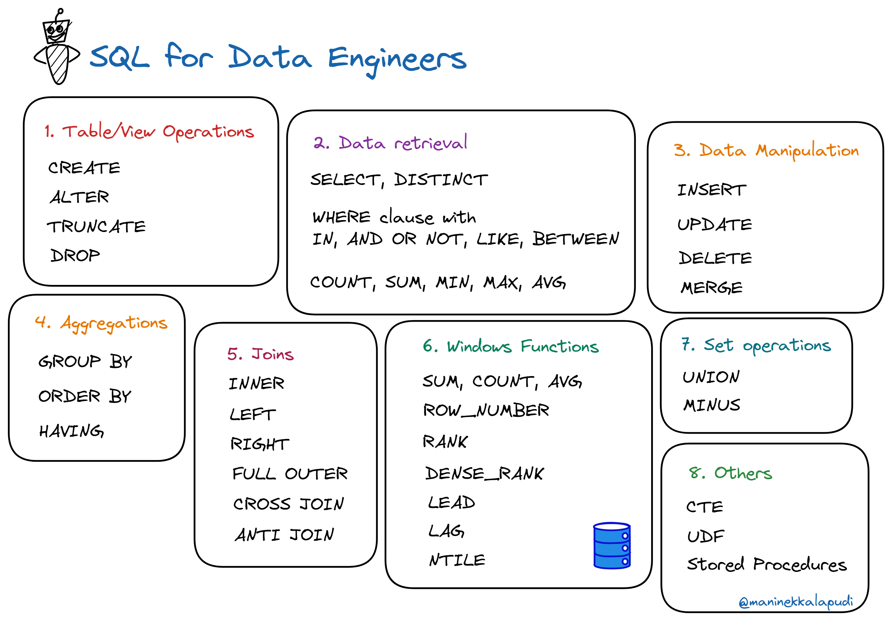

### What is SQL?

SQL (Structured Query Language) is a [declarative language](https://en.wikipedia.org/wiki/Declarative_programming) for storing, manipulating and retreiving data in databases and many other data systems.

We write queries like statements in SQL to perform actions on data or the database itself. Example: A query retreives all the records from a database table

```sql
SELECT * FROM <database_name>.<table_name> 
```

SQL offers a simple interface to interact with data stored in a database without having to write lengthy programs. This has served wide veriety of data personnel from various backgrounds well over four decades.

### Why Data Engineers Need SQL?

Data engineering tools and processes have evolved quite a lot over the years. One tool kept its relevance through all these times i.e., SQL.

Since SQL offered a simple interface to deal with data, many data warehousing tools like [Hive](https://aws.amazon.com/big-data/what-is-hive/), [Snowflake](https://www.snowflake.com/en/), and query engines like [Apache Spark](https://spark.apache.org/) adopted SQL as one of their main interfaces.

This will help data teams to work with SQL for many tasks like

  1. Building data models
  2. Light-weight data cleaning
  3. Data transformations and testing
  4. Data analysis
  5. Building reports

Of course, the SQL is not be-all and end-all solution for all data engineering tasks but it is necessarily a very important skills in modern data engineering.

### SQL Topics

|  |
|:--:|
| *SQL Topics*|

1. Table/View Operations

   - `CREATE`
   - `ALTER`
   - `TRUNCATE`
   - `DROP`

2. Data Retrieval

   - `SELECT`, `DISTINCT`
   - `WHERE` clause with `IN`, `AND`, `OR`, `NOT`, `LIKE` and `BETWEEN`
   - `COUNT`, `SUM`, `MIN`, `MAX`, `AVG`

3. Data Manipulation

   - `INSERT`
   - `UPDATE`
   - `DELETE`
   - `MERGE`

4. Aggregations

   - `GROUP BY`
   - `ORDER BY`
   - `HAVING`

5. Joins

   - `INNER`
   - `LEFT`
   - `RIGHT`
   - `FULL OUTER`
   - `CROSS JOIN`
   - `ANTI JOIN`

6. Windows/Analytics functions

   - `SUM`, `COUNT`, `AVG`
   - `ROW_NUMBER`
   - `RANK`
   - `DENSE_RANK`
   - `LEAD`
   - `LAG`
   - `NTILE`

7. Set Operations

   - `UNION`
   - `MINUS`

8. Others

   - `CTE`
   - `UDF`
   - Stored Procedures
