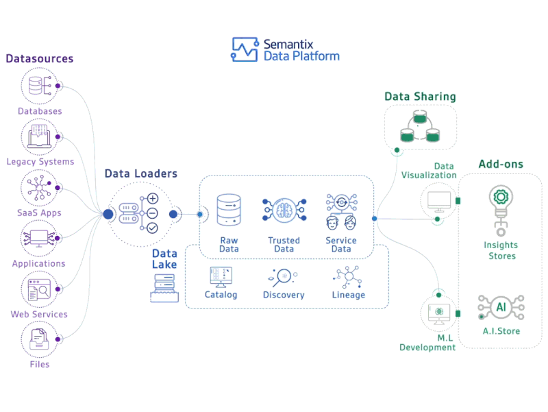

Hello learner 👋, Welcome to the data engineering guide!

### Introduction

As data engineers we deal with various data and engineering aspects to deliver the data to various stakeholders. There are a ton of tools used in the modern data architectures.

As a beginner or even as an experienced data professional, it is very easy to get lost trying to understand what skills are required for data engineering and how to become a data engineer.

This guide intends to solve that specific problem. It provides a clear path to the core data engineering skillset and beyond. More on this guide [here](https://www.learndataengineering.guide/faqs/).

### Modern Data Engineering Landscape

The opensource revolution of the [Hadoop ecosystem](https://www.geeksforgeeks.org/hadoop-ecosystem/) years enabled every oraganization to build their own data platforms with plethora of tools.

Shortly after their success, the opensource tools fell short of their expectations since they needed lot of software engineering, networking and baby-sitting skills to get the right data output within time.

The [modern data engineering platform](https://towardsdatascience.com/the-building-blocks-of-a-modern-data-platform-92e46061165) greatly abstracts a lot of complexities of the data stack of the previous [Hadoop](https://www.javatpoint.com/what-is-hadoop) years. The focus is on serving the quality data at scale with confidence and as minimal intrevention as possible.

In modern data platforms, the opensource tools are productized and they abstract the complexity away from the end users i.e., data teams. For example: [Databricks](https://www.databricks.com/) offers [Apache Spark](https://spark.apache.org/) as a unified compute platform for data engineering and data science workloads.

Also, in the data field, old is new. The terms like [data governance](https://www.ibm.com/in-en/topics/data-governance) and [data lineage](https://www.ibm.com/in-en/topics/data-lineage#:~:text=Data%20lineage%20is%20the%20process,destination%20within%20the%20data%20pipeline.) all existed in enterprise data warehousing long before Hadoop came into picture. Since the focus has shifted from data tools to resulting data once again, We see a growing interest in enterprise data mamanagement tools and processes like these.

All of the data engineering activties in the [data engineering lifecycle](https://glossary.airbyte.com/term/data-engineering-lifecycle/) are achieved using few core skills listed below.

### Skillset for Modern Data Engineering

Without complicating, data engineers need strong data skills and good software engineering skills

#### a. Data Skills

- SQL
- Data Warehousing basics
- Data Modelling

#### b. Software Engineering Skills

- One programming language. Preferrably Python.
- Git

#### c. Data Engineering Tools

- Basics of distributed computing
- Hadoop Ecosystem Components
- Data Warehouse like Apache Spark with Cloud Storage or Snowflake, BigQuery

#### d. Additional Skills

- Pipeline Orchestration tools like Airflow, Azure Data Factory and etc
- Cloud services for data engineering
